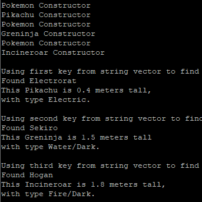

Pokemon Database is a database I developed by myself in C++ which uses constructors and destructors for a pokemon class, as well as child classes for specific types of pokemon, to create a database of pokemon on my "team".

The "user interface" is hard coded to interact with the classes set up. With this, the imaginary user is able to create pokemon by calling constructors, find a specific pokemon by their name that the player gave to them, and when the program quits it calls the destructor for each one.

```cpp
//electrorat, sekiro, hogan
    
    Pokemon * myteam[3];
    myteam[0] = new Pikachu;
    myteam[1] = new Greninja;
    myteam[2] = new Incineroar;

    //{"Electrorat", "Sekiro", "Hogan"}

    vector<string> nicknames;

    nicknames.push_back("Electrorat");
    nicknames.push_back("Sekiro");
    nicknames.push_back("Hogan");

    map<string, Pokemon *> namemap;
    
    namemap["Electrorat"] = myteam[0];
    namemap["Sekiro"] = myteam[1];
    namemap["Hogan"] = myteam[2];
```

-----
-----


