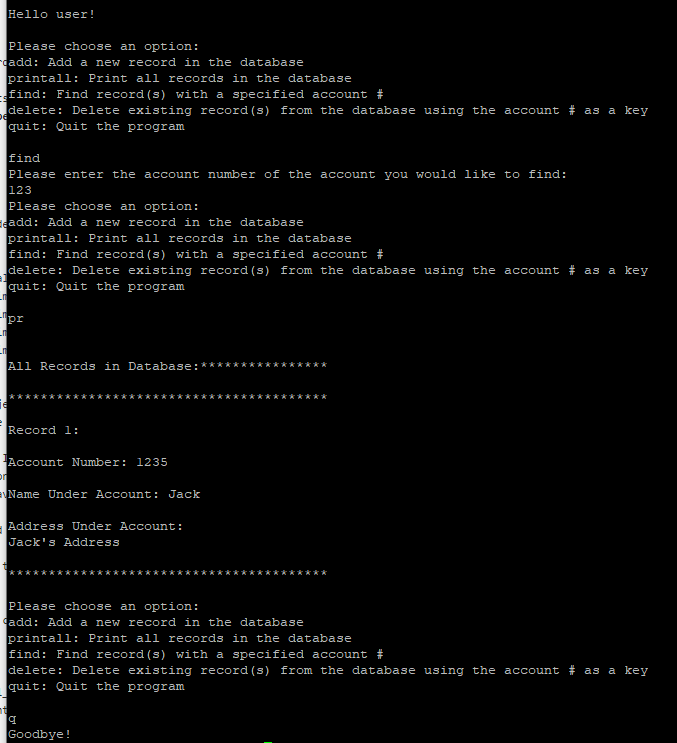

<div class="ui small rounded images">
  
</div>

For my second project in ICS 212 I was tasked with creating a database system for something like a bank. The system would take a customers information including account number, the customers name and the customers address. Then the system would be able to do a host of other functions with the data it has collected from the user. This includes finding an account with the account number, printing all accounts in the system, deleting an account, and finally there is an option to quit the program. 

These options and the collection of information are all done through a text screen in a command terminal, without the assistance of a GUI or other similar application. For this project, I used entirely C++. I was the only person who worked on this project and it took me approximately 3 days to finish properly.


Here is some code that illustrates how I got input from the user:

```cpp
    while (!quit)
    {
        cout << "Please choose an option:\n";
        cout << "add: Add a new record in the database\n";
        cout << "printall: Print all records in the database\n";
        cout << "find: Find record(s) with a specified account #\n";
        cout << "delete: Delete existing record(s) from the database using the account # as a key\n";
        cout << "quit: Quit the program\n\n";
        
        getline(cin, command);

        if (stradd.rfind(command) == 0)
        {
            cout << "What is the account number?\n";
            
            cin.getline(inp, 10);
            stringstream number(inp);
            number >> account;
            while (account < 0)
            {
                cout << "Please enter a positive number\n";
                cin.getline(inp, 10);
                stringstream number(inp);
                number >> account;
            }
            
            cout << "What is the name of the account holder?\n";

            cin.getline(inp, 100);
            while (strlen(inp) > 25)
            {
                cout << "Your input is too long. Please enter 25 characters or less.\n";
                cin.getline(inp, 100);
            }

            strcpy(name, inp);
            
            cout << "What is the address of the account holder?\n";
            cout << "Please end the address with a greater than sign(>)\n";
            
            cin.getline(inp, 100, '>');
            cin.getline(trash, 100);
            while(strlen(inp) > 50)
            {
                cout << "Your input is too long, please shorten it to 50 characters or less.\n";
                cout << "Remember to end your address with a greater than sign(>)\n";
                cin.getline(inp, 100, '>');
                cin.getline(trash, 100);
            }

            cout << "\n";
            
            list.addRecord(account, name, inp);
        }
```


